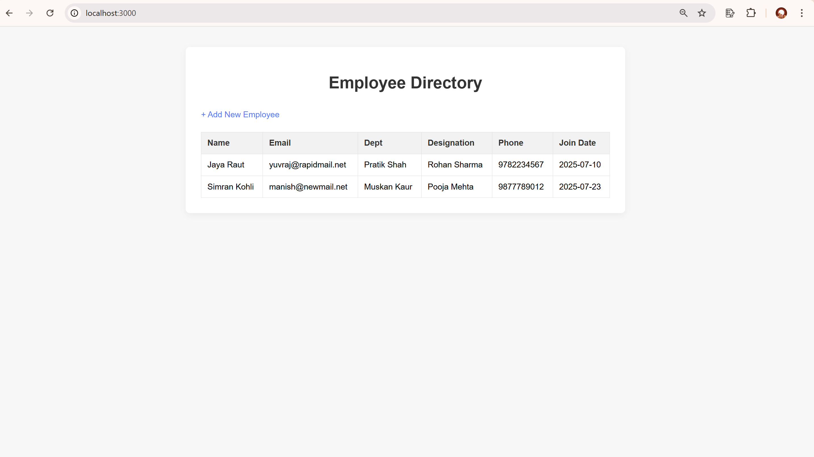

# 🧾 Employee Directory App

A clean and minimal **Employee Management System** built using **Node.js**, **Express**, **MySQL**, and **EJS**, with Docker support.

---

## ✨ Features

- Add new employees through a web form  
- View a list of employees  
- Server-side rendering with EJS  
- MySQL database integration  
- Clean and responsive UI  
- Dockerized for easy setup

---

## 📦 Tech Stack

- **Node.js** + **Express.js**  
- **MySQL2** (MySQL client for Node)  
- **EJS** (template engine)  
- **Body-Parser**, **Dotenv**  
- **Docker** + **Docker Compose**

---

## 📸 Screenshot



---

## 🛠️ Installation (Without Docker)

```bash
npm init                          # Initialize Node.js project
npm install express mysql2 ejs body-parser dotenv  # Install required packages
npm install -g nodemon           # Install nodemon globally for dev use
npm run dev                      # Start development server with live reload
npm start                        # Start production server (node server.js)


```
```bash
docker-compose up --build        # Build Docker images and start containers
docker-compose down -v           # Stop and remove containers, networks, and volumes
docker-compose build             # Rebuild Docker images
docker-compose up                # Start containers (after build)
```